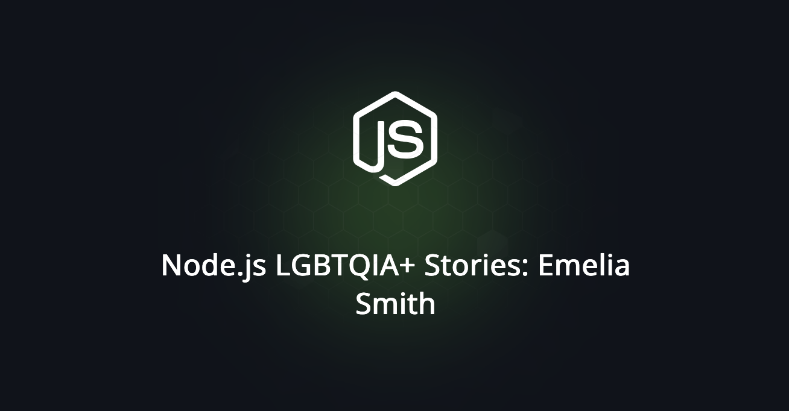

## Node.js LGBTQIA+ 서사: Emelia Smith
> 원문을 읽고 싶으신가요? [여기](https://nodejs.org/en/blog/community/2025-06-28-Emelia-Smith)를 확인해 보세요.

작성자: Emelia Smith

[Carl](https://nodejs.org/en/blog/community/2025-pride)이 이 시리즈 오프닝 블로그 포스트에서 우아하게 표현했습니다. "우리가 어렸을 때는, 많은 사람들에게 있어서 규칙이 간단했습니다. 소년들은 소녀들을 좋아하고, 그 반대로도 그랬죠. 엄마가 아빠를 만나고 서로 충분히 좋아한다면 아기가 나온다구요!" 그가 이렇게 말했을 때 우리의 경험과 맞아떨어졌습니다.

저는 호주의 아주 시골인 지역에서 자랐습니다. 작은 시골 마을에서요. 여름에는 무진장 더웠고, 딱히 할 게 그렇게 많지 않았습니다. 자라면서 어떤 사람들은 게이일 수도 있다는 걸 알았지만 게이인 사람을 실제로 알지는 못했습니다. 트랜스젠더인들이 존재한다는 것도 알았지만 저 같은 사람이 트랜스젠더일 수도 있다는 것은 알지 못했습니다. 사회가 오늘날과 같이 LGBTQIA+ 정체성들을 수용하지 않았으니까요. 저는 항상 제가 사는 사회에 제가 잘 맞지 않는다고 느꼈습니다.

호주의 그 지역에서는 축구를 하거나 수영을 하는 것 외에는 별로 할 일이 없었기 때문에, 저는 온라인 커뮤니티로 피신하였습니다. 원래 저는 그래픽 디자이너가 되고 싶었습니다. 제가 예술을 좋아했기 때문이죠. 그렇게 저는 DeviantART.com 이라는 사이트로 가게 됐고, 거길 통해 인터넷 채팅방에 들어가게 됐습니다. 그 채팅방 중 한 곳이 IT 지원 채팅방이었습니다. 저는 컴퓨터를 좋아했는데, 컴퓨터로 사람들을 도울 수도 있겠다는 생각이 들었습니다. 그렇게 다른 흥미로 옮겨가게 되고, 프로그래밍을 하고 웹 개발에 대해 배우는 자신을 보았습니다.

2008년에 저는 웹 개발 같은 것들이 커리어가 될 수도 있겠다는 것을 깨달았습니다. 리크루터가 제가 XULRunner로 만들고 있던, DeviantART 웹사이트의 채팅방 클라이언트에 대한 제 블로그 포스트 일부분을 보았을 때 말이죠. 저는 그 당시 15살이었고, 그걸 믿을 수 없었습니다. 결국 이 일이 잘 마무리되진 않았지만, 그걸 통해 제가 배우는 것에 가치가 있다는 것, 그리고 제 컴퓨터에서 여러 가지를 하면서 미래에 직장을 구할 수도 있다는 것을 볼 수 있었습니다. 2008년에는 상황이 달라졌습니다. 제가 작업 중이던 채팅 클라이언트를 통해 처음으로 비동기 네트워크 I/O를 경험했었고, 그 경험이 무척 마음에 들었습니다.

빠르게 한 해가 지나가고, JSConf.eu의 Ryan이 Node.js를 발표했을 때였습니다. 영상을 시청하고 저는 바로 Node.js를 사용해 보고자 했는데요. Node.js는 제가 네트워크 I/O에 사용하던 XULRunner로 작업하곤 했던 것과 비교하면 훨씬 나아 보였습니다. 또 다른 흥미로 옮겨가면서, 저는 Node.js에 기여하기 시작했습니다. 당시에는, 코드가 쓰인 지 얼마 안 됐었고 고칠 버그와 추가할 기능이 많았기에 꽤 쉬웠습니다. 상당히 초기에 제가 거기 있었으니까요. npm과 자바스크립트 패키지 매니저의 탄생을 목격하기도 하고, connect와 express의 초기 버전을 보기도 하고, 프로젝트가 자라나는 걸 보았습니다. 아주 흥미로운 시기였습니다!

제 초기 Node.js 기여에는 fs.readdirSync 메소드를 추가하는 것, fs.chmod를 추가하는 것, Node.js에서 웹소켓을 가능하게 한 'upgrade' 이벤트를 구현하는 것이 있었습니다. (1세대 웹소켓 서버 패키지를 유지보수 하기도 하였습니다.) 그렇게 저는 주기적으로 기여하고, 초기 커뮤니티를 통해 많은 것들을 배웠습니다.

제가 Node.js에 적용한 가장 큰 변화로는 문서를 여러 파일과 페이지로 분할한 것이 있습니다. 이 변화 이전에는 모든 문서가 한 거대한 페이지로 들어갔거든요. 이 변화를 통해 저는 당시 프로젝트의 최상단 10위 기여자로 올라갈 수 있었습니다. 순수하게 코드에서 변경된 줄의 수 덕분에 말이죠. 이 기여는 제가 고등학교 졸업 이후 바로 샌프란시스코에 있는 회사에 취직할 수 있게 해주었던 그런 기여였습니다. 덕분에 IRC에서 보았던 많은 공동체의 사람들과 만날 수 있었습니다. Noded라는 최초의 Node.js 팟캐스트(라디오)를 Mikeal Rogers와 함께 운영하기도 하였는데, 2010년에 프로젝트의 핵심 인물들의 아직 미공개인 인터뷰도 있습니다. (아마 언젠가 제가 이걸 편집하고 공개시킬 수도 있겠죠?)

20대 중반 전까지는 제가 퀴어라는 걸 깨닫지 못했습니다. 사무실로 가는 버스를 타면서 "남자와 여자의 옷이 그렇게 다른가?" 하는 질문을 고심이 했던 기억이 납니다. 당시에는 자신을 이성애자이자 시스젠더로 생각하던 사람이 하기에는 꽤 이상한 질문이었지만, 이것저것 따져보다가 "아니. 그냥 옷이잖아. 그렇게 다르지 않아." 라고 결론을 내렸습니다. 이 순간이 제가 제 자신이 다르게 입어볼 수 있다고 스스로에게 허락하는 순간이었고, 이때 저는 저 스스로에게 다른 걸 시도해 보는 게 금기시되는 일이 아니라고 말하게 됐습니다. 이맘때쯤, 저는 거울에서 보이는 제 자신과 제가 일치하지 않다고 느끼는 문제를 겪고 있었습니다. 그렇게 제 자신이 제가 생각했던 시스젠더 남성이 아니라는 것을 깨닫게 됐습니다. 2014/2015년 새해로 넘어가는 바로 전날, 저는 젠더퀴어로 커밍아웃하였고 제 젠더 표현을 실험해 보기 시작했습니다.

제가 제 정체성을 찾아가던 당시, 저는 멋진 퀴어인들을 더 많이 만났습니다. (제가 옷장에서 나올 수 있게 도와준 모임을 열어준 Jessie에게 큰 감사를 드립니다.) 런던이 제가 있을 장소가 아니라는 걸 깨닫고, 베를린으로 가서 Node.js와 함께 일하고 스타트업을 만들어 가기도 하였습니다. 1년 뒤, 저는 제가 단순히 젠더퀴어가 아니고, 실제로는 트랜스여성이라는 것을 깨달았습니다. 동시에 레즈비언이면서요.

이제 제가 커밍아웃을 하고 자랑스럽게 산 지 10년이 되었습니다. 저는 여전히 오픈소스에 자주 기여합니다. 사실, 오늘날 제 작업의 상당 부분은 오픈 소스 소프트웨어와 관련되어 있습니다. 저는 아직 Node.js를 자주 사용하고, 여러 패키지에 기여합니다. 하지만 저는 더 이상 코어 프로젝트에는 기여하지 않습니다. 지금은 제 자체 오픈 소스 프로젝트와 Mastodon, Hollo에 기여하고 Adonis.js 프레임워크의 사람들을 돕는 데 제 시간을 사용합니다. 높은 확률로 제가 기여한 소프트웨어를 어떤 식으로든 사용하셨을거라 생각합니다. 거의 확실하게도 LGBTQIA+인 사람들이 만든 코드를 사용해보셨을 거구요.

Node.js는 항상 LGBTQIA+ 공동체의 활발한 참여와 대표성을 보여주었습니다. 저에게 있어서는, Node.js와 DeviantART 공동체가 제 피신처였습니다. 제가 맞아떨어지지 않는 세상을 살고 있었을 때, 저는 안전한 공간을 찾았습니다. Node.js 없이는 제가 지금 가지고 있는 경험을 가지고 있지 않았을 거고, 제가 만났던 아름다운 사람들을 만나지 않았을 것이며, 먼지 나는 작은 시골 마을을 벗어나 시야를 넓히고 변화를 겪고 제 행복을 찾지 못했을 겁니다.

오늘날의 제가 있게 된 것은 전적으로 Node.js 덕분입니다.